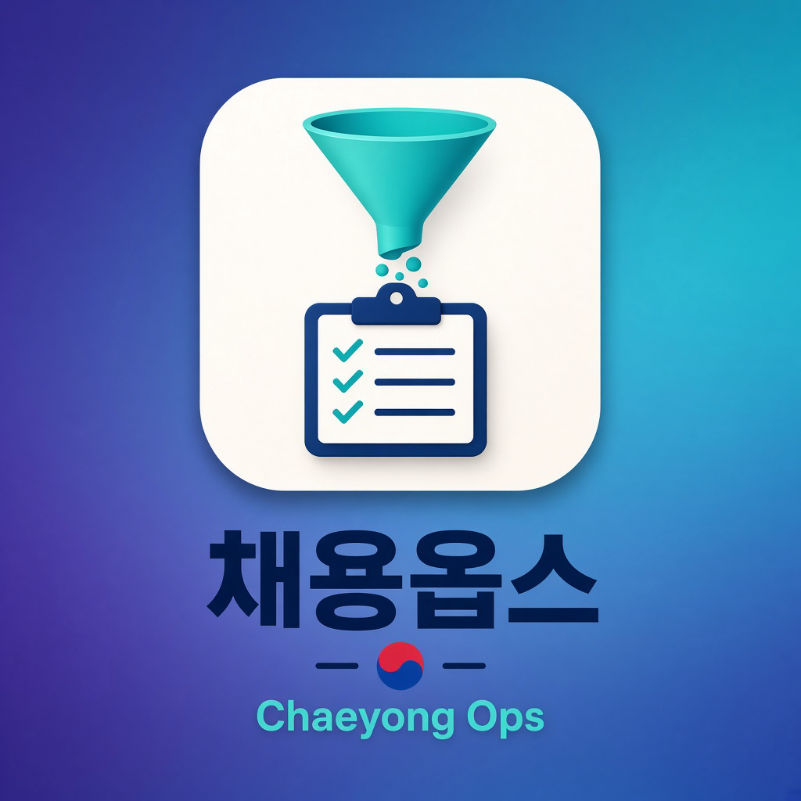
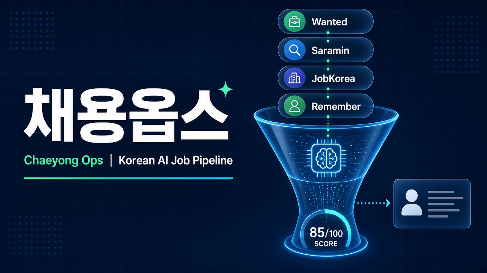
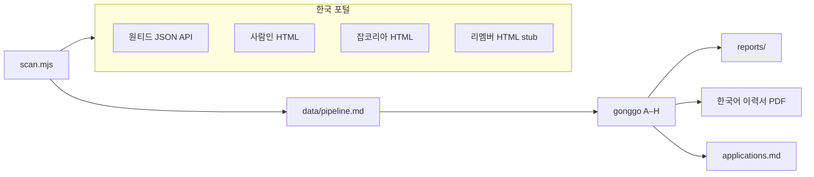

<p align="center">
  
</p>

<h1 align="center">채용옵스 (Chaeyong Ops)</h1>

<p align="center"><strong>한국 채용 시장을 위한 AI 구직 파이프라인</strong></p>

<p align="center">
  공고를 모으고 · 점수를 매기고 · 맞춤 이력서를 만들고 · 지원을 추적합니다.<br>
  무차별 지원 도구가 아닙니다. <em>시간을 쓸 가치가 있는 소수</em>를 걸러내는 필터입니다.
</p>

<p align="center">
  
  
  
  
  
  <a href="NOTICE.md"></a>
</p>

<p align="center">
  
</p>

> [career-ops](https://github.com/career-ops-hq/career-ops) 기반 포크 · MIT License · **채용옵스**라는 별도 제품명으로 배포합니다. `career-ops` 이름·로고는 원저작자 상표입니다.

**제출 전 반드시 직접 검토하세요.** 4.0/5 미만 공고에는 지원하지 않는 것을 권장합니다.

**지금 지원하려면 → [docs/APPLY-KR.md](docs/APPLY-KR.md)**  
프로필 → `cv.md` → `node scan.mjs` → `gonggo` **≥ 4.0** → `pdf` / `jiwon` → 포털에서 **직접** 제출.

## 출처 및 라이선스

| 항목 | 내용 |
|------|------|
| 기반 프로젝트 | [career-ops](https://github.com/career-ops-hq/career-ops) (MIT) |
| 원저작권 | Copyright (c) 2026 Santiago Fernández de Valderrama |
| 이 포크 | [torisKR/chaeyong-ops](https://github.com/torisKR/chaeyong-ops) |
| 라이선스 | MIT — 수정·재배포·상업적 이용 가능 ([LICENSE](LICENSE), [NOTICE](NOTICE.md)) |
| 상표 | `career-ops` 이름·로고는 원저작자 상표입니다. 이 프로젝트는 **채용옵스**라는 별도 이름으로 배포합니다. |

### 포크 시 지켜야 할 조건

1. **원저작권 표시와 MIT 라이선스 문구 유지** (`LICENSE` 파일)
2. **수정 내용과 원본 저장소 링크 명시** ([NOTICE.md](NOTICE.md))
3. **보증 없음 조항 유지**
4. 다른 저장소 코드를 섞으면 해당 라이선스도 별도 확인
5. **API 키, 이력서, 연락처, 지원 기록은 공개 저장소에 포함하지 않기**

## 이게 뭔가요

채용옵스는 Cursor / Claude Code / Codex / OpenCode 등 [에이전트 스킬 표준](https://agentskills.io) CLI에서 동작하는 오픈소스 구직 자동화입니다. 한국 포털(원티드·사람인·잡코리아·리멤버)을 스캔하고, 공고를 **A–H** 구조로 평가하고, 한국어 ATS 이력서 PDF를 만들고, 지원 현황을 한 트래커에 모읍니다.

기본 타깃 예시(템플릿): **풀스택 / 백엔드(NestJS·Node.js·TypeScript)**. 아키타입은 `modes/_profile.md`와 `config/profile.yml`에서 바꿉니다.



| 기능 | 설명 |
|------|------|
| **한국 포털 스캔** | 원티드(JSON API), 사람인·잡코리아(HTML 파싱), 리멤버(공개 HTML stub · 기본 비활성) |
| **A–H 평가** | 역할 요약부터 공고 진위(Block G)와 지원서 초안(Block H)까지 |
| **한국어 모드** | 정규직 / 수습 / 포괄임금제 / 4대 보험 등 한국 채용 맥락 (`modes/ko/`) |
| **영어 필수 필터** | `content_filter.negative`로 원어민·영어 회화 필수 공고 제외 |
| **맞춤 PDF** | `cv-template.ko-standard.html` — 한글 타이포 + 한국어 섹션 |
| **Human-in-the-Loop** | AI가 평가하고 추천하면, 당신이 판단하고 행동합니다. 시스템은 절대 지원서를 제출하지 않습니다 — the system never submits an application. 최종 결정은 항상 당신의 몫입니다. <!-- hitl: absolute guarantee. Do not add "automatically", "by itself", "without your permission" or any other hedge when translating this row. --> |
| **파이프라인 무결성** | 트래커 병합, 중복 제거, 상태 정규화, 헬스 체크 |

## 포털 커버리지

`templates/portals-kr.example.yml`을 `portals.yml`로 복사한 뒤, **이용약관·robots.txt를 확인한 다음에만** `enabled: true`로 바꿉니다.

| 포털 | Provider | 방식 | 기본 `enabled` | 비고 |
|------|----------|------|----------------|------|
| **원티드** | `wanted` | 공개 JSON `GET /api/v4/jobs` | `true` | 키워드: 백엔드·풀스택·NestJS·Node.js·TypeScript. CloudFront 403 시 집 네트워크에서 재시도 또는 URL 붙여넣기. [이용약관](https://www.wanted.co.kr/) 확인 |
| **사람인** | `saramin` | HTML 검색 파싱 | `false` | robots.txt·ToS 확인 후 활성화 |
| **잡코리아** | `jobkorea` | HTML 검색 파싱 | `false` | robots.txt·ToS 확인 후 활성화 |
| **리멤버** | `remember` | 공개 `/job/postings` HTML stub | `false` | robots.txt는 `/job/` 허용. Cloudflare가 데이터센터 IP를 차단하는 경우가 많음. **우회하지 않음** |

글로벌 ATS(Greenhouse, Ashby, Lever)에 올라온 한국 지사 공고는 기존 `tracked_companies`로 스캔할 수 있습니다.

### ⚠️ 채용 사이트 이용약관

MIT 라이선스가 원티드·사람인·잡코리아·리멤버의 이용약관을 대체하지 **않습니다**. provider를 활성화하기 전 각 사이트의 robots.txt와 이용약관에서 자동 수집 허용 범위를 확인하세요. Cloudflare/WAF 챌린지를 우회하거나 로그인 wall을 뚫지 않습니다.

### ⚠️ 개인 데이터 — 공개 저장소에 커밋하지 마세요

`cv.md`, `config/profile.yml`, `portals.yml`, `data/*`, 연락처·지원 기록은 **gitignored** 입니다. 예제 파일(`config/profile.example.yml`, `cv.example.md`)만 추적합니다. 예제의 이름·이메일은 placeholder입니다. **실명 전화번호·개인 이메일을 커밋하지 마세요.** 개인용은 비공개 저장소가 안전합니다.

## 빠른 시작

전체 지원 순서(스캔 → 4.0 필터 → PDF → 수동 제출)는 **[docs/APPLY-KR.md](docs/APPLY-KR.md)** 입니다.

### 1. 클론

```bash
git clone https://github.com/torisKR/chaeyong-ops.git
cd chaeyong-ops
npm install
```

### 2. 프로필 · 포털

```bash
cp config/profile.example.yml config/profile.yml
cp templates/portals-kr.example.yml portals.yml
cp cv.example.md cv.md   # 구조만 참고. 숫자·회사명은 본인 사실로 교체
```

`config/profile.yml`에서 이름, 이메일, 목표 역할, 세전 연봉 범위를 입력합니다. 기본값:

```yaml
language:
  output: ko
  modes_dir: modes/ko

target_roles:
  primary:
    - "풀스택 개발자"
    - "백엔드 개발자"
```

### 3. 이력서

프로젝트 루트 `cv.md`가 소스 오브 트루스입니다. AI CLI에게 "이력서 작성 도와줘"라고 하면 onboarding을 안내합니다. 허구 metric을 넣지 마세요 — 있는 사실만.

### 4. 사용 예시

AI CLI에서 `/chaeyong-ops` 또는 자연어로:

| 입력 | 동작 |
|------|------|
| 채용 URL / JD 붙여넣기 | **auto-pipeline** — 평가 + PDF + 트래커 |
| `scan` | `node scan.mjs` — 원티드·사람인·잡코리아·리멤버 |
| `gonggo` | 한국어 공고 **A–H** 평가만 |
| `triage` | 1차 빠른 점수 (PASS만 full 평가) |
| `pipeline` | `data/pipeline.md` 대기 URL 일괄 처리 |
| `pdf` | 한국어 ATS 이력서 (`ko-standard`) |
| `jiwon` | 지원서 폼 작성 도우미 — **제출은 직접** |
| `cover` / `email` | 자기소개서·지원 메일 초안 |
| `batch` | `batch/batch-runner.sh` 대량 평가 |
| `tracker` | 지원 현황 |

```bash
node scan.mjs
node doctor.mjs --json
```

## 한국 포털 설정

`templates/portals-kr.example.yml` 기본 키워드는 백엔드·풀스택·NestJS·Node.js·TypeScript 입니다.

```yaml
job_boards:
  - name: Wanted — 백엔드
    provider: wanted
    searchKeywords: "백엔드"
    max_pages: 5
    enabled: true
  # + Wanted — 풀스택 / NestJS / Node.js / TypeScript (portals-kr.example.yml)

  - name: Saramin — 개발
    provider: saramin
    searchKeywords: "백엔드"
    enabled: false   # 이용약관 확인 후 true

  - name: JobKorea — 개발
    provider: jobkorea
    searchKeywords: "백엔드"
    enabled: false   # 이용약관 확인 후 true

  - name: Remember — 개발
    provider: remember
    careers_url: https://career.rememberapp.co.kr/job/postings
    enabled: false   # robots.txt·ToS·Cloudflare 확인 후 true
```

## 영어 필수 공고 제외

```yaml
content_filter:
  negative:
    - "영어 회화 필수"
    - "원어민"
    - "native english"
```

영어 필수 역할을 지원하려면 해당 키워드를 제거하세요.

## 한국어 모드

`modes/ko/` — 한국 채용 시장용 평가·지원. 개인 타깃(아키타입, 연봉, 출근 정책)은 **`modes/_profile.md`** / **`config/profile.yml`** 에만 적습니다. `modes/_shared.md`에 개인 사실을 넣지 마세요.

| 파일 | 역할 |
|------|------|
| `_shared.md` | 한국 채용 용어, 경력 평가 기준, 영어 필수 처리 |
| `gonggo.md` | 채용 공고 A–H 평가 |
| `jiwon.md` | 지원서 작성 |
| `scan.md` | 포털 스캔 |
| `pipeline.md` | URL inbox 처리 |

## 지원 CLI

Claude Code, Cursor, Codex, OpenCode, Antigravity CLI, Qwen, Kimi, GitHub Copilot 등 [에이전트 스킬 표준](https://agentskills.io) CLI에서 동작합니다.

## 기여

Issue와 PR을 환영합니다. 한국 포털 provider 개선, 평가 기준 보강, 문서 번역 모두 좋습니다. 새 provider는 [providers/ADDING_A_PROVIDER.md](providers/ADDING_A_PROVIDER.md)를 따르세요.

## 관련 링크

- [원본 career-ops](https://github.com/career-ops-hq/career-ops)
- [career-ops MIT 라이선스](https://raw.githubusercontent.com/career-ops-hq/career-ops/main/LICENSE)
- [career-ops 상표 정책](https://raw.githubusercontent.com/career-ops-hq/career-ops/main/TRADEMARK.md)
- [NOTICE.md](NOTICE.md) — 이 포크의 수정 사항
- [docs/APPLY-KR.md](docs/APPLY-KR.md) — 한국 지원 워크플로 (scan → gonggo ≥4.0 → 수동 제출)
- [assets/](assets/) — 채용옵스 로고·파비콘
